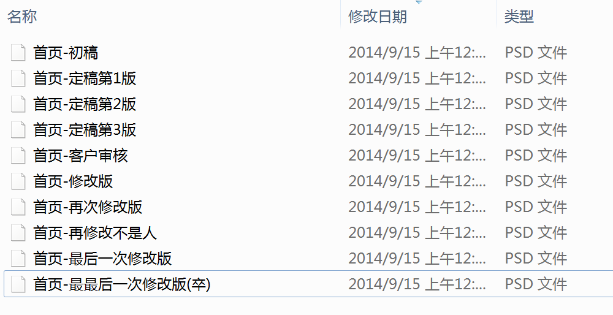

# Git 引入   

> 学习目标: 
>
> 知道我们引入 git 的目的
>
> 以及能够知道 git 可以使用的场景

### 场景   

> 如果遇到文本需要修改很多次, 并且都需要做备份和记录的时候怎么办呢? 
>
> 我们可以使用 git 
>
> 它能够帮助我们记录各个不同的版本. 并且可以实时的把各个不同的版本进行整合记录.

### 总结:    

* 我们使用 git 可以做版本的控制

* 也可以使用 git 记录每次修改的内容. 并且进行整合

	

