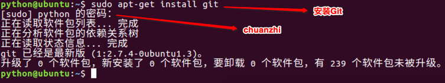
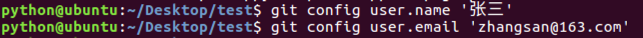
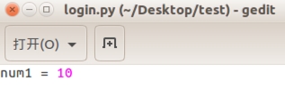
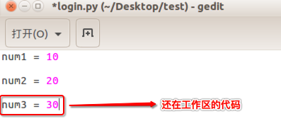

 # <font color="orange">Git 单人操作---准备阶段   </font>

> 学习目标：
>
> 知道 git 的安装和配置

### <font color="blue">git 安装   </font>

> 安装 git

```python
# 安装 git 
sudo apt-get install git

# 密码：chuanzhi
```

> 参数解读: 
>
> sudo :  超级管理员权限, 如果使用该权限, 需要添加密码
>
> apt-get : 包管理工具
>
> install : 安装的意思




### <font color="blue">查看安装结果   </font>

> 想要查看 git 是否安装成功, 需要我们调用 git 命令: 

```
git
```

> 调用该命令后, 如果出现大篇幅的命令, 代表安装 git 成功.
>
> 如果出现 'git 不是内部或外部命令' 字样. 则 git 安装失败


### <font color="blue">创建项目   </font>

> 在桌面创建 `test` 文件夹, 作为项目文件

```bash
mkdir Desktop/test
```


### <font color="blue">创建本地仓库   </font>

> 进入到刚刚创建的文件中 :  cd  Desktop/test/
>
> 初始化 git , 从而创建本地仓库

```python
# 初始化 git 得到本地仓库

git init
```

> 补充: 
>
> 进入到 `test`，并创建本地仓库 `.git`
>
> 新创建的本地仓库`.git`是个空仓库


##### 创建本地仓库`.git`后


### <font color="blue">配置个人信息   </font>

```python
# 配置个人的用户名: 
git config user.name '张三'
# 配置个人的邮箱地址: 
git config user.email 'zhangsan@163.com'
```



##### 配置个人信息后


> 默认不配置的话，会使用全局配置里面的用户名和邮箱
> 全局 git 配置文件路径：~/.gitconfig


### <font color="blue">总结:    </font>

* git 的安装使用的命令是:  `sudo apt-get install git `
* 查看 git 是否安装成功也可以调用 git 命令
* 安装完 git 之后会生成一个 .git 文件
* 我们可以配置当前用户的对应信息, 配置的时候使用 config 命令


# <font color="orange">Git 单人操作第一部分   </font>

> 学习目标: 
>
> 能够掌握 git 的相关常见操作

### <font color="blue">增加文件   </font>

* 在项目文件 `test `里面创建 `login.py` 文件，用于版本控制演示

    

### <font color="blue">查看文件状态   </font>

```
# 使用方式:

git status
```

> 敲这个命令后: 
>
> - 如果为红色, 表示新建的文件或者修改的文件,  在工作区.
> - 如果为绿色, 表示文件在暂存区


### <font color="blue">工作区提交到暂存区   </font>

```python
# 使用方式: 
# 第一种提交方式: 
git add .


# 第二种提交方式:
git  add  login.py
```


### <font color="blue">暂存区提交到仓库区   </font>

```python
# 使用方式: 

git commit -m  '描述信息'
```

> * commit  会进行一次本地仓库提交
>
> - -m  后面是添加的是本次提交的描述信息


###  <font color="blue">修改工作区, 再提交   </font>

```python
# 提交到暂存区: 
git add .

# 提交到本地仓库区: 
git commit -m "版本描述"
```

> - 代码编辑完成后即可进行 `add` 和 `commit` 操作


### <font color="blue">查看提交的历史记录   </font>

```python
# 使用方式: 
# 第一种: 
git log

# 第二种: 
git reflog
```


> git reflog 可以查看所有分支的所有操作记录（包括 commit 和 reset 的操作），包括已经被删除的commit 记录，git log 则不能察看已经删除了的 commit 记录


### <font color="blue">总结:    </font>

* 无论对工作区的文件进行了增加,  删除, 还是修改操作. 都可以使用 git 提交到暂存区

* 提交到暂存区使用:  git add .   

* 提交到本地仓库区使用:  git  commit  -m   '信息'

* 查看 git 的状态可以使用:  git  status 

* 查看历史提交记录可以使用:  git  log 或是 git  reflog

	


# <font color="orange">Git 单人操作第二部分   </font>

> 学习目标: 
>
> 掌握 git 版本回退和代码撤销的方法

### <font color="blue">回退版本   </font>

#### 方案一：

```python
# 使用方式: 

git reset --hard 版本
```

> - `HEAD`  表示当前最新版本
> - `HEAD^ `表示当前最新版本的前一个版本
> - `HEAD^^` 表示当前最新版本的前两个版本，**以此类推...**
> - `HEAD~1` 表示当前最新版本的前一个版本
> - `HEAD~10 `表示当前最新版本的前10个版本，**以此类推...**

例如: 

```
git  reset  --hard  HEAD^
```




#### 方案二：

>  当版本非常多时可选择的方案
>
> 通过每个版本的版本号回退到指定版本

```
git reset --hard 版本号
```


### <font color="blue">工作区代码撤销   </font>

```python
# 使用方式: 

git checkout 文件名
```

> - 只能撤销工作区、暂存区的代码, 不能撤销仓库区的代码
> - 撤销仓库区的代码就相当于回退版本操作

例如: 

> 新加代码  `num3 = 30` ，不 `add` 到暂存区，保留在工作区

```
git checkout 文件名
```




### <font color="blue">暂存区代码撤销   </font>

>  新加代码 `num3 = 30`，并 `add` 到暂存区

```python
# 第一步：将暂存区代码撤销到工作区
git reset HEAD  文件名

# 第二步：撤销工作区代码
git checkout 文件名
```


### <font color="blue">总结:    </font>

* 回退到别的版本使用:  `git reset --hard  版本/版本号`
* 撤销工作区的代码:  `git  checkout  文件名`
* 撤销暂存区的代码:  `git  reset  HEAD 文件名`    和   `git  checkout  文件名`