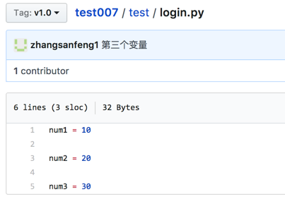

# <font color="orange">标签   </font>

> 学习目标: 
>
> 知道标签的作用和设置方法

### <font color="blue">标签的作用   </font>

> 当某一个大版本完成之后,需要打一个标签
>
> 作用：
>
> - 记录大版本
> - 备份大版本代码


### <font color="blue">模拟设置标签   </font>

* 1.进入到经理的本地仓库 `test007`

   ```
   cd  Desktop/manager/test007/
   ```
   
* 2.经理在本地打标签

   ```python
   # 使用方式: 
   
   git tag -a 标签名 -m '标签描述'
   ```

   例如: 

   ```python
   #  标签名为 v1.0  
   #  标签描述为: version 1.0
   git tag -a v1.0 -m 'version 1.0'
   ```

   

* 3.经理推送标签到远程仓库

   ```python
   # 使用方式: 
   
   git push origin 标签名
   ```

   例如: 

   ```python
   # 将标签推送到远端: 
   git push origin v1.0
   ```

   > 这里的 origin 代表远端的意思

   

* 4.查看打标签结果

    

    > 补充：删除本地和远程标签

    ```
    # 删除本地标签
    git tag -d 标签名
    
    # 删除远程仓库标签
    git push origin --delete tag 标签名
    ```


### <font color="blue">总结:    </font>

* 标签是在某一个大版本完成之后, 设置的标记
* 添加标签使用:  `git  tag  -a  v1.0  -m '信息'`