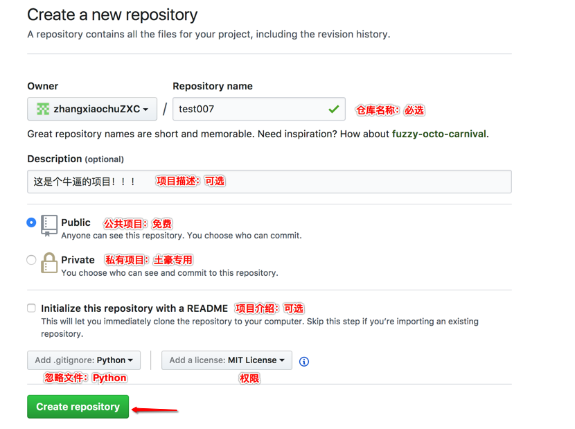
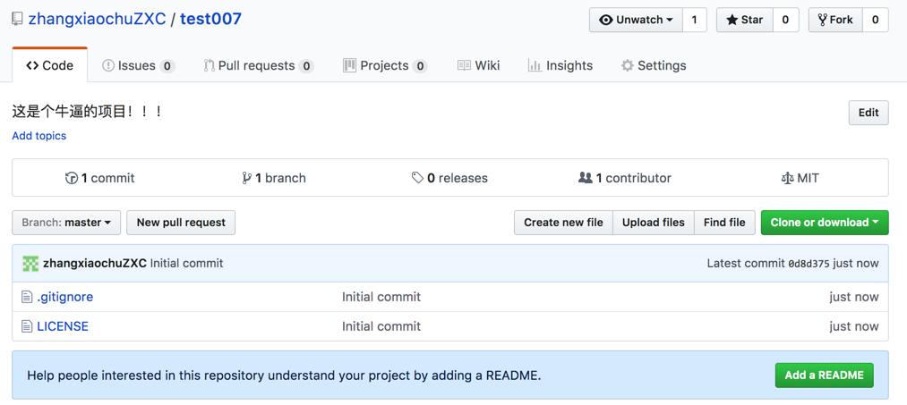
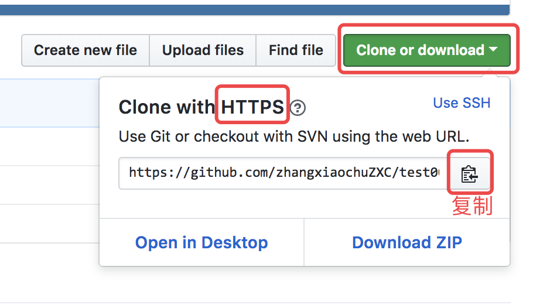

# Git 远程仓库 

> 学习目标: 
>
> 掌握远端仓库的创建和克隆方式

### 准备工作:    

> 在 Github 网站上创建远程仓库

- 注册 Github 账号  `https://github.com/`
- 准备经理的文件夹  `Desktop/manager/`
- 准备张三的文件夹  `Desktop/zhangsan/`

### 创建远程仓库   

> 提示：
>
> Github 网站作为远程代码仓库时的操作和本地代码仓库一样的.
>
> 只是仓库位置不同而已！

### 编辑仓库信息   

### 查看远端仓库 

### 将远程仓库拷贝到本地   

> 远程仓库地址   https://github.com/zhangxiaochuZXC/test007.git

### 总结:    

* Github 是世界上最大的源代码开放平台
* 我们可以在 Github 或者是码云上创建远程仓库
* 创建远程仓库需要添加一些信息, 如上图所示
* 创建好远程仓库后, 可以使用  `git   clone   地址`  命令拷贝到本地