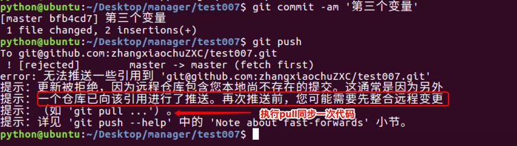
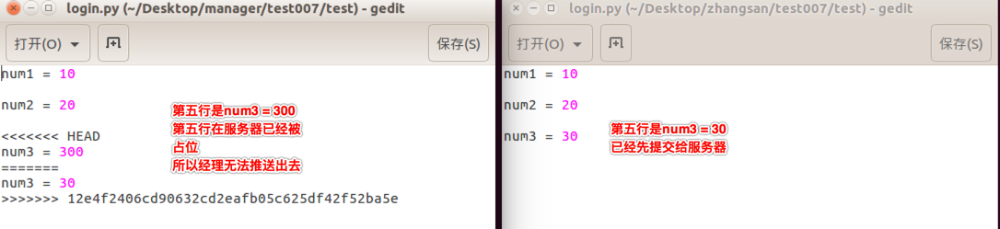

# 代码冲突   

> 学习目标: 
>
> 掌握冲突产生的原因和解决方法

### 代码冲突产生的原因   

设想一下: 

如果张三和经理都修改了同一行代码, 并且都进行了提交, 那么服务端应该保存谁的代码呢?

这时就会产生冲突

> - **提示**：多人协同开发时，避免不了会出现代码冲突的情况
> - **原因**：多人同时修改了同一个文件
> - **危害**：会影响正常的开发进度
> - **注意**：一旦出现代码冲突，必须先解决再做后续开发

### 演示冲突   

#### 张三先编辑文件中的代码

> - 进入张三本地仓库：`cd Desktop/zhangsan/test007`
>
> - 拉取服务器最新代码：`git pull`
>
> - 编辑代码：`num3 = 30`
>
> - 本地仓库记录版本：
>
> 	`git  add  .`
>
> 	`git commit -m '第三个变量'`
>
> - 推送到服务器仓库：`git push`
>
> - 张三本地仓库和远程仓库代码如下：

#### 经理后编辑文件中的代码

> - 进入经理本地仓库：`cd Desktop/manager/test007/`
>
> - 编辑代码：`num3 = 300`
>
> - 本地仓库记录版本：
>
> 	`git  add  .  `
>
> 	`git commit -m '第三个变量'`
>
> - 推送到服务器仓库：`git push`
>
> - **以上操作会出现代码冲突:**
>
> 	- 提示需要先 pull

* 提示冲突文件

    

* 冲突代码表现

    

* 解决冲突
    > - 原则：谁冲突谁解决，并且一定要协商解决
    > - 方案：保留所有代码 或者 保留某一人代码
    > - 解决完冲突代码后，依然需要`add`、`commit`、`push`

    

    

    * 提示：如果张三执行`pull`没有影响，就算真正解决了冲突代码

#### 补充：   
* **容易冲突的操作方式**
    * 多个人同时操作了同一个文件
    * 一个人一直写不提交
    * 修改之前不更新最新代码
    * 提交之前不更新最新代码
    * 擅自修改同事代码

* **减少冲突的操作方式**
    * 养成良好的操作习惯,先`pull`在修改,修改完立即`commit`和`push`
    * 一定要确保自己正在修改的文件是最新版本的
    * 各自开发各自的模块
    * 如果要修改公共文件,一定要先确认有没有人正在修改
    * 下班前一定要提交代码,上班第一件事拉取最新代码
    * 一定不要擅自修改同事的代码

### 总结:    

* 明确冲突产生的原因

* 知道解决冲突的方法

	