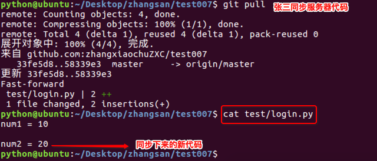

# <font color="orange">多人协同开发   </font>

> 学习目标: 
>
> 掌握多人协同开发的方法

### <font color="blue">修改张三的代码并推送到远端   </font>

> - 进入张三本地仓库：`cd Desktop/zhangsan/test007`
>
> - 编辑代码：`num1 = 10`
>
> - 本地仓库记录版本：
>
> 	`git  add  .`
>
> 	 `git commit -m '第一个变量'`
>
> - git commit -am '第一个变量'`
>
> - 推送到远程仓库：`git push`


### <font color="blue">经理拉取远端代码到本地</font>

经理想要获得张三提供的内容, 需要调用拉取的命令:

```python
# 拉取远端代码到本地: 

git pull
```

### <font color="blue">修改经理的代码并推送到远端   </font>

> 进入经理本地仓库： `cd  Desktop/manager/test007/`
>
> 编辑代码： `num2 = 20`
>
> 本地仓库记录版本：
>
> `git  add  .`
>
>  `git commit -m '第二个变量'`
>
> 推送到远程仓库：`git  push`


.


### <font color="blue">张三拉取远端代码到本地   </font>

> 本次可以把 `num2` 同步到张三的本地仓库



> 按照以上步骤循环操作，即可实现基本的协同开发

### <font color="blue">总结：   </font>

* 要使用 git 命令操作仓库，需要进入到仓库内部
* 要同步远端代码执行： `git pull`
* 本地仓库记录版本执行： `git commit -am '版本描述'`
* 推送代码到服务器执行：`git push`
* 编辑代码前要先 `pull`，编辑完再 `commit`，最后推送是 `push`

