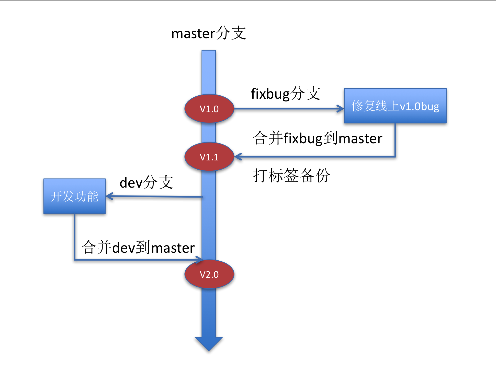
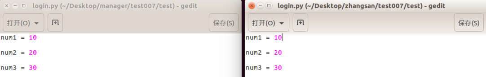
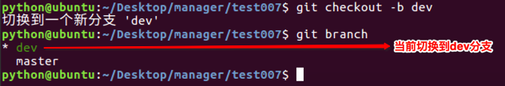
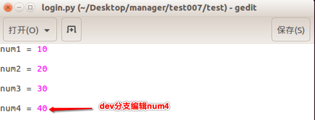
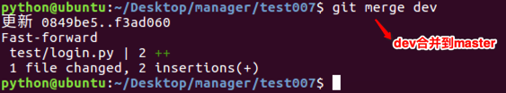
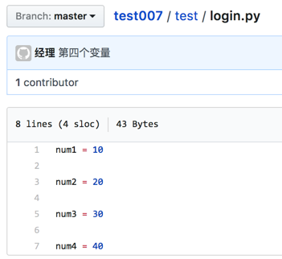
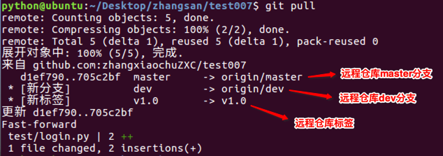

# <font color="orange">分支   </font>

> 学习目标: 
>
> 了解分支的设置方法和作用

### <font color="blue">分支的作用和特点:    </font>

- 作用：
	- 主分支:   生产环境(维护线上环境)
	- 子分支:   开发环境(研究开发新的功能, 攻关难题,  解决线上 bug)
- 特点：
	- 项目开发中使用多个分支进行工作, 例如: master、dev 等
	- dev 分支是用于开发的分支，开发完阶段性的代码后，需要合并到 master 分支
	- master 分支是默认分支，主要用于发布工程



### <font color="blue">模拟分支操作   </font>

* 对比：操作分支前的代码

    

* 进入到经理的本地仓库`test007`

   ```
   cd Desktop/manager/test007/
   ```

* 查看当前分支

  ```
  git branch
  ```

  没有创建其他分支时，只有 `master` 分支

* 经理创建并切换到 dev 分支

   ```
   git checkout -b dev
   ```

  
  
* 将分支推送到远程
  
  ```
  git push -u origin dev
  ```

* 经理在 dev 分支编辑代码

   

* 管理 dev 分支源代码：`add`、`commit`、`push`

  

  

* dev 分支合并到 master 分支
  
  > 提示：只有当 dev 分支合并到 master 分支成功，张三才能获取到 `num4`
  
* 先切换到 master 分支
  
        git checkout master
    
    
    
* dev 分支合并到 master 分支

    ```python
    git merge dev
    ```



经理推送合并分支操作到远程仓库

> 合并分支默认在本地完成，合并后直接推送即可

```
git push
```



* 张三同步经理合并后的 `num4`
  
* 只有当张三同步代码成功，分支合并才算成功
  
        cd  Desktop/zhangsan/test007/
        
        git pull
    
    
        


### <font color="blue">总结:    </font>

* 分支主要用于区分生产环境和线上环境
* 我们可以在子分支上开发代码, 然后合并到主分支上
* 分支在公司开发中使用比较多. 一般由经理设置分支.