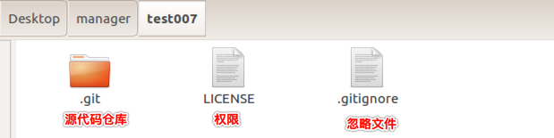
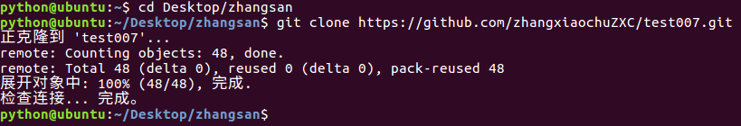
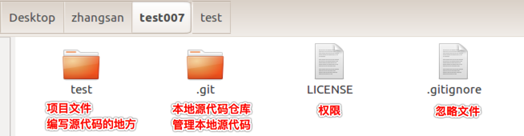

# <font color="orange">给不同用户克隆项目   </font>

> 学习目标: 
>
> 掌握如何给不同的用户克隆同一个项目

### <font color="blue">给经理克隆远端项目   </font>

> 立项：克隆远程仓库+配置身份信息+创建项目+推送项目到远程仓库

##### 克隆远程仓库的命令

```python
# 克隆远端的项目到本地
# 可以使用 HTTPS
cd Desktop/manager/
git clone https://github.com/zhangxiaochuZXC/test007.git

# 也使用 SSH
cd Desktop/manager/
git clone git@github.com:Fly744055970/test002.git
```

##### 克隆远程仓库到本地


##### 克隆成功后查看经理的文件



##### 配置经理身份信息

```python
# 进入经理的工程中
cd Desktop/manager/test007/

# 配置经理的身份信息
git config user.name '经理'
git config user.email 'manager@163.com'
```


### <font color="blue">给张三克隆远端项目   </font>

> 获取项目：克隆项目到本地、配置身份信息

##### 克隆项目到本地

```python
# 进入张三的文件夹中
cd Desktop/zhangsan/

# 克隆远端的项目到本地
git clone https://github.com/zhangxiaochuZXC/test007.git
```



##### 克隆成功后查看张三的文件



##### 配置张三身份信息

```python
# 进入张三的工程中
cd Desktop/zhangsan/test007/

# 配置张三的身份信息
git config user.name '张三'
git config user.email 'zhangsan@163.com'
```

> 张三身份信息配置成功后即可跟经理协同开发同一个项目

### <font color="blue">经理修改工程   </font>

> 经理在工程中增加了新的文件, 并在其中添加了代码


##### 推送项目到远程仓库

```python
# 工作区添加到暂存区
git add .

# 暂存区提交到仓库区
git commit -m '立项'

# 推送到远程仓库
git push
```


- 在 push 的时候需要设置账号与密码，该密码则是 github 的账号与密码

	- 如果在每次 push 都需要设置账号与密码，那么可以设置记住密码

	```python
	# 设置记住密码（默认15分钟）：
	git config --global credential.helper cache
	
	# 如果想自己设置时间，可以这样做(1小时后失效)：
	git config credential.helper 'cache --timeout=3600'
	
	# 长期存储密码：
	git config --global credential.helper store
	```

> 在以后的项目开发过程中，Pycharm 可以自动记住密码

### <font color="blue">张三获取修改后的工程   </font>

> 经理已经修改了远端的工程, 所以张三可以拉取远端最新的工程到本地

```python
# 调用该命令可以拉取远端工程: 
git  pull  
```

### <font color="blue">总结:    </font>

* 我们可以在不同用户的电脑上克隆同一份远端项目
* 克隆的远端项目可以进行修改,  修改完成后, 我们也可以进行推送. 推送到远端
* 可以使用多人共同开发一个项目