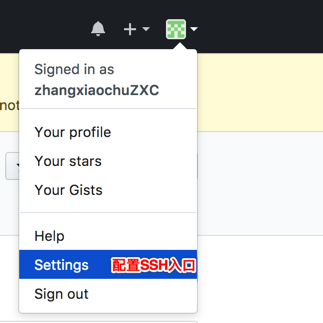
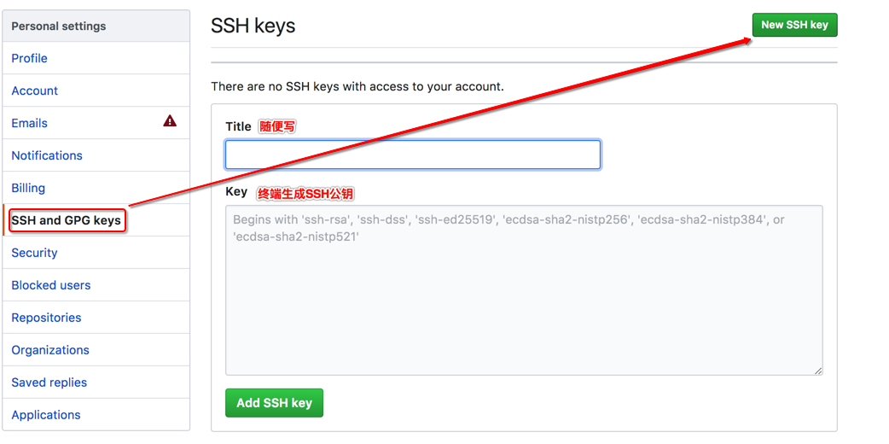
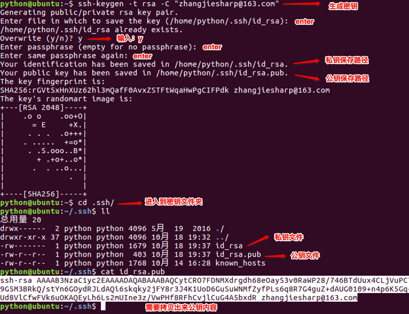
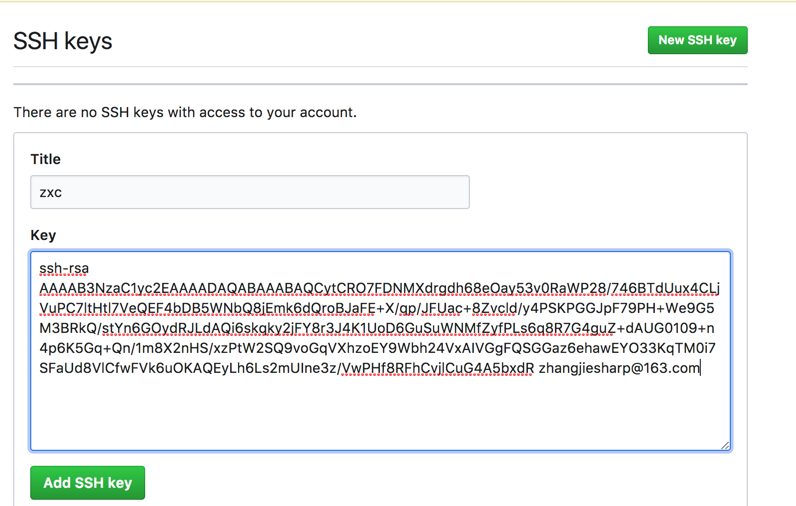
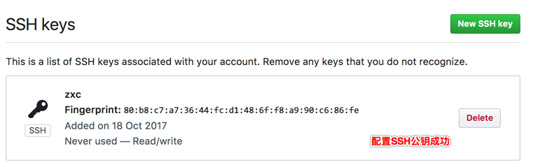

# <font color="orange">使用 SSH 克隆项目   </font>

> 学习目标: 
>
> 掌握 SSH 克隆项目的配置和方法

### <font color="blue">了解 SSH 登录方式   </font>

> 我们之前已经可以通过 https 的方式, 从 Github 获取远端仓库了:
>
> ``git  clone  https://地址``
>
> 除此以外, 我们还可以使用 SSH 的方式从 `Github` 上获取远端仓库.
>
> 如果想要使用该功能, 我们需要把 SSH 的公钥添加到 Github 上.
>
> 那么就要把这台电脑的 SSH 公钥添加到这个 `Github` 账户上

### <font color="blue">在 Github 上配置 SSH 公钥   </font>






### <font color="blue">修改电脑端 git 配置   </font>

> 在电脑上配置 Github 的注册邮箱和用户名

```bash
# 在命令行调用如下命令: 

vim .gitconfig
```

```bash
# 修改下列字段: 

[user]
    email = 邮箱@163.com
    name = 注册的 github 名称
```


### <font color="blue">生成 SSH 公钥   </font>

```bash
# 调用该命令, 生成 SSH 公钥

ssh-keygen -t rsa -C "zhangjiesharp@163.com"
```



### <font color="blue">查看生成的公钥信息:    </font>

```python
# 使用该命令查看公钥文件: 
cat ~/.ssh/id_rsa.pub
```


### <font color="blue">完善 Github 中 SSH 公钥信息   </font>




>  补充：删除旧的秘钥
>
> 删除`~/.ssh`目录，这里存储了旧的密钥
>
> ```python
> rm -r .ssh
> ```

### <font color="blue">使用 SSH 克隆远端项目到本地   </font>

> 复制 Github 中 SSH 的对应地址, 使用 git  clone 的命令克隆到本地: 

```python
# 使用方法: 

git  clone  git@github.com:MeiEnHao/test007.git
```


### <font color="blue">总结:    </font>

* 知道从 Github 网站克隆项目的两种方式:  https  和  SSH

* 使用 SSH 需要把生成的公钥内容拷贝到 Github 中

* 无论是 https 还是 SSH 克隆项目使用的命令都是  ```git  clone  地址```

	