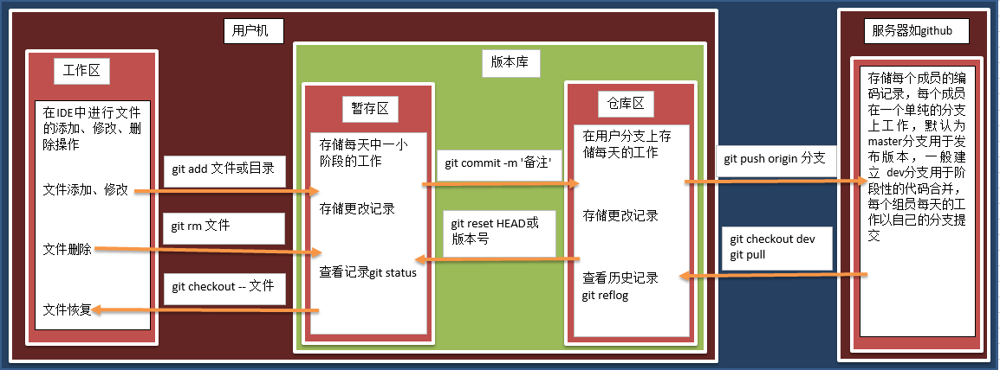

# Git 中的模块   

> 学习目标: 
>
> 掌握 git 中的三个区域以及各自的特点

### 工作区   

> git 中的工作区指的就是我们平时写代码的区域, 
>
> 例如:
>
> 编译器中( pycharm, vscode ).    
>
> 作用: 
>
> 工作区的主要作用就是对文件进行 `添加`、`修改`、`删除`等操作

### 暂存区   

> git 中临时存储数据的一个区域, 我们成为暂存区.
>
> 特点: 
>
> 这个区域我们一般看不到. 但他实际存在.  我们可以把代码临时保存在这里. 也可以撤销
>
> 主要作用是: 
>
> 为了让用户能够把数据进行长久存储前, 可以进行筛查, 反悔等操作, 而创建的区域

###仓库区   

> git 中本地进行长久存储的一个区域
>
> 特点: 
>
> 主要存储一个小阶段的成果. 防止丢失
>
> 我们一般把暂存区的内容存储到这里. 以方便以后查看. 
>
> 暂存区的内容存储到本地仓库区后, 暂存区的内容将会销毁. 
>
> 我们可以在本地仓库区存放多个版本的信息. 并且可以在不同的版本中进行跳转.
>
> 提示：本地仓库是个 .git 隐藏文件   

### 关联关系   

> 上面三个区的关系, 我们可以通过如下的图片查看: 

### 总结:    

* 知道 git 在本地有三个区域, 分别为:  工作区, 暂存区, 仓库区
* 工作区是写代码的区域
* 暂存区是临时储存数据的区域
* 仓库区是在本地长久保存数据的区域