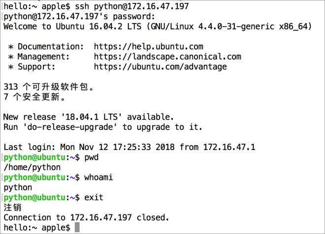
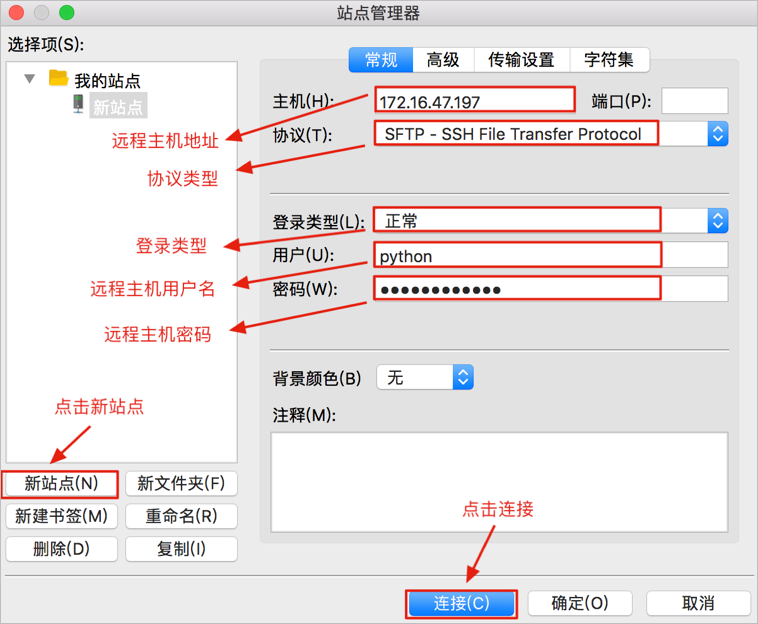
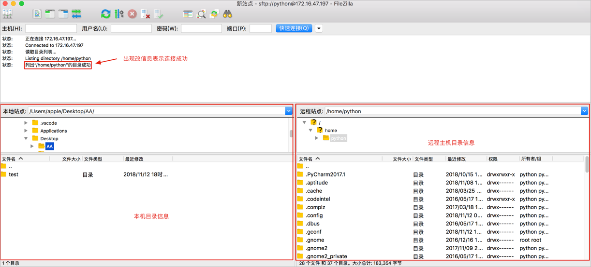
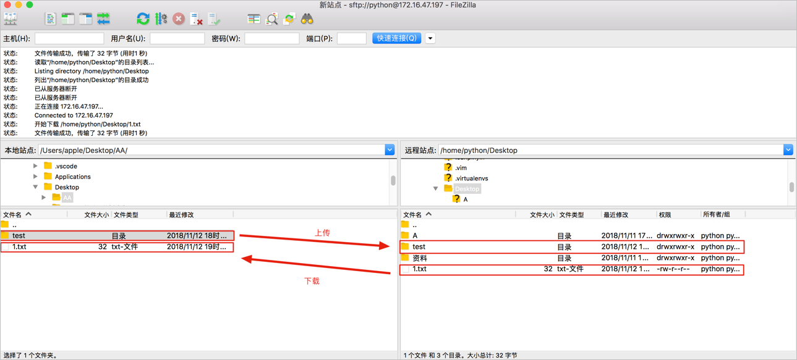

# 远程登录、远程拷贝命令

** 学习目标 **

* 能够写出远程拷贝、远程登录命令

---

### 1. 远程登录、远程拷贝命令的介绍

| 命令 | 说明 |
| :--- | :--- |
| ssh | 远程登录 |

### 2. ssh命令的使用

ssh是专门为远程登录提供的一个安全性协议，常用于远程登录，想要使用ssh服务，需要安装相应的服务端和客户端软件，当软件安装成功以后就可以使用ssh命令了，以后可以通过远程登录之间操作远程的服务器。

**远程登录效果图:**

**软件安装步骤:**

1. 假如Ubuntu作为服务端,需要安装ssh服务端软件. 执行命令: **sudo apt-get install openssh-server**
2. 客户端电脑如果是 **macOS** 系统则不需要安装 ssh 客户端软件，默认已经安装过了，**直接可以使用 ssh 命令**
3. 客户端电脑如果是Windows系统则需要安装**OpenSSH for Windows**这个软件

** ssh命令格式: **

ssh 用户名@ip地址

** ssh命令效果图: **

**说明:**

* 在一台电脑上可以安装安装ssh客户端和ssh服务端软件
* 在Ubuntu安装ssh客户端命令: sudo apt-get install openssh-client

### 3. FileZilla软件的使用

FileZilla 是一个免费开源的FTP软件, 使用可视化方式进行上传和下载文件。以后可以通过 FileZilla 来代替 **scp** 命令

**FileZilla使用效果图:**

### 4. 小结

* ssh命令是远程登录主机电脑，相当于直接操作的是远程电脑。
* 大量的文件上传和下载可以通过可视化工具FileZilla来完成。

